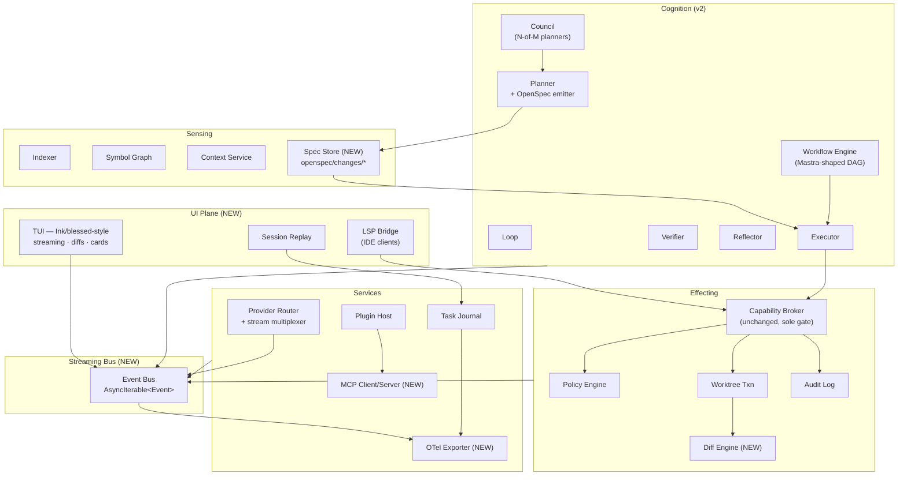

# Archon Runtime v2 — Design

Status: **proposed** (May 2026). Builds on M0–M24 (see `ROADMAP.md`, `ROADMAP-INTELLIGENCE.md`). Atomic decisions land as ADRs.

> One-sentence thesis: **Archon already has the engine. v2 adds the windshield, the dashboard, and a standards-compliant trailer hitch — without unbolting the safety chassis.**

---

## 0. North star

Archon v2 is the **persistent, project-native engineering runtime** the spec asked for: a terminal-first realtime copilot that *thinks visibly, edits reversibly, and integrates openly*, while every side effect still passes through one Capability Broker. The differentiator from Claude Code / Cursor / OpenHands / Aider / Devin is not "more agents" — it is **constrained autonomy under a single proof-carrying safety gate, with the broker as the only authority distributor**.

Non-goals (still): a hosted SaaS, a distributed actor framework, an in-process vector DB, a new policy DSL.

---

## 1. Where v1 ends, v2 begins

| Capability | v1 (M0–M24) | v2 gap |
| --- | --- | --- |
| 4 planes + broker + worktree txns | ✅ | — |
| Multi-provider routing, fallback, budget breaker | ✅ | + **streaming tokens to UI** |
| Symbol/boundary/risk/preservation/simulation | ✅ | + **reasoning DAG surfaced to TUI** |
| Agent factory + agent broker + skills | ✅ | + **multi-agent orchestration (workflows + council)** |
| TUI (markdown, syntax HL, ⏺ turns) | ✅ | + **streaming, diff viewer, tool-call cards, token meter, approval cards** |
| Task Journal | ✅ | + **session replay UI + OpenTelemetry export** |
| Plugin ABI v0 | ✅ | + **MCP client/server + LSP bridge + spec engine plugin point** |
| Cognition loop primitive | ✅ | + **OpenSpec-style change proposals as the load-bearing plan artifact** |

Everything below is additive; nothing in M0–M24 is rewritten.

---

## 2. Topology v2 (diff over v1)



Two new physical surfaces only: the **Streaming Bus** (a typed in-process event bus) and the **UI Plane** (decoupled renderers). Everything else slots into existing modules.

---

## 3. Runtime lifecycle (v2 sequence)

```mermaid
sequenceDiagram
  participant U as User (TUI)
  participant TUI
  participant Loop as Cognition.Loop
  participant Plan as Planner (+ Spec)
  participant WF as Workflow
  participant Exec
  participant Broker
  participant Prov as Provider Router
  participant Bus as Event Bus

  U->>TUI: prompt
  TUI->>Bus: turn.start
  TUI->>Loop: run(goal)
  Loop->>Plan: plan(goal, context)
  Plan->>Prov: stream(plan-llm, prompt)
  Prov-->>Bus: token.delta*
  Bus-->>TUI: render(reasoning, tokens, cost)
  Plan->>Plan: emit OpenSpec change proposal
  Plan->>Bus: plan.ready(spec)
  Bus-->>TUI: render diff(spec.delta)
  TUI->>U: approve?
  U->>TUI: approve
  Loop->>WF: execute(spec)
  WF->>Exec: step
  Exec->>Broker: fs.write/exec/net
  Broker->>Broker: policy(action, target, blastRadius)
  alt allow
    Broker-->>Exec: ok
  else ask
    Broker->>Bus: approval.request
    Bus-->>TUI: approval card
    TUI->>Broker: approve/deny
  else deny
    Broker-->>Exec: error
  end
  Exec->>Bus: tool.result(diff)
  Bus-->>TUI: diff card
  WF->>Verify: gate
  Verify-->>Bus: verdict
  alt green
    Tx->>Tx: commit worktree
    Loop->>Bus: turn.done
  else red
    Loop->>Reflect: retry|abort
  end
```

Key invariants preserved from v1: **plan → act → verify → reflect**; broker is the only side-effect path; verdict-or-rollback worktree txn.

---

## 4. New subsystems

### 4.1 Streaming Bus

Single in-process typed event bus. Producers: provider router (token deltas), broker (audit/approval), cognition (plan/step/verdict), workflow (graph progression), sensing (index ticks). Consumers: TUI, Replay, OTel, plugins.

```ts
// src/services/event-bus.ts (NEW)
export type ArchonEvent =
  | { kind: 'token.delta'; runId: string; provider: string; text: string; usage: TokenUsage }
  | { kind: 'plan.ready'; runId: string; spec: OpenSpecChange }
  | { kind: 'tool.start'; runId: string; tool: string; argsSummary: string }
  | { kind: 'tool.result'; runId: string; tool: string; diff?: UnifiedDiff; outcome: 'ok'|'err' }
  | { kind: 'approval.request'; runId: string; capability: string; payload: ApprovalPayload }
  | { kind: 'approval.resolve'; runId: string; decision: 'allow'|'deny' }
  | { kind: 'reflect.trace'; runId: string; node: ReasoningNode }
  | { kind: 'verdict'; runId: string; ok: boolean; summary: string }
  | { kind: 'turn.start' | 'turn.done'; runId: string };

export interface EventBus {
  publish(e: ArchonEvent): void;
  subscribe(filter?: EventFilter): AsyncIterable<ArchonEvent>;
}
```

Implementation: a single `AsyncQueue`-based fanout; back-pressure via bounded ring per subscriber (drop with `event.lost` counter rather than block the producer — never let the UI starve the engine).

### 4.2 Provider router → stream multiplexer

Today the router routes by task class with fallback. v2 wraps every provider in a `StreamSession` that yields `{ tokens, usage, finishReason }` deltas. The router stays in front: it owns the cache, the budget breaker, and the fallback — but instead of awaiting a full response, it splices token streams onto the bus with one `runId`. Cached responses replay as a single synthetic-delta event to preserve UI semantics.

### 4.3 Diff engine

Worktree commits already produce diffs. The Diff Engine layers above:

- **Unified diff** for compactness (default render).
- **Side-by-side** for review surface.
- **AST diff** (TS only, via existing host-side `ts-morph`) for "did the *meaning* change" — used by Verifier to drop noise (renames, formatting) from regression evaluation.
- **Patch staging**: a `PatchSet` is the minimal unit of approval; user can selectively reject hunks pre-commit. The worktree commits only the accepted subset; rejected hunks are recorded as `pending-followup` in the journal so they don't get lost.

### 4.4 Reasoning visibility (without leaking raw CoT)

Three render modes: **off** (default), **summary** (per-phase one-liner via a `reasoning.compress` model call — cheap, cached), **trace** (the structured nodes the Planner already emits: `analyse → propose → simulate → decide`). Never expose raw provider thinking tokens; only the agent's own structured trace and a compressor-summary. Toggle via `/think off|summary|trace`.

### 4.5 OpenSpec integration

OpenSpec ([Fission-AI/OpenSpec](https://github.com/Fission-AI/OpenSpec)) is a markdown-based **change-proposal protocol**. It fits Archon's design-before-act invariant exactly. We adopt it as **the plan artifact**.

```
openspec/
  project.md                 # generated from M8 architectural fingerprint
  specs/                     # current capability specs (per bounded context)
    auth/spec.md
    indexer/spec.md
  changes/
    2026-05-25-add-streaming-tui/
      proposal.md            # why · what · why-now
      tasks.md               # generated by Planner; checked off by Executor
      design.md              # only if Risk ≥ medium (per existing risk engine)
      specs/                 # delta operations
        tui/spec.md          # ADDED / MODIFIED / REMOVED markers
  archive/
    2026-05-24-*/            # archived on successful merge
```

**Mapping (one-to-one with existing planes):**

- **Planner** emits the change folder instead of (or alongside) its current plan tree. The OpenSpec format is the public contract; the internal plan tree stays as the execution-time representation.
- **Verifier** treats `tasks.md` as the success matrix: every unchecked task is a failed gate.
- **Tx** archives the change folder on commit, discards on rollback.
- **Memory.promotion** mines the archive for procedural memory (recurring patterns become skills).
- **/spec** command (new): `archon spec status | diff | validate | archive` — wraps the OpenSpec CLI conventions but routes every file write through the broker. We do **not** vendor the OpenSpec Node CLI; we re-implement the spec validator as a ~200-line pure-TS module so it stays inside the broker. (If upstream becomes a library, we swap to that — single dep, deferred.)

**Why this over a custom format:** OpenSpec gives us (a) a stable, human-readable handoff format other tools/teams can read, (b) the `tasks.md` ↔ checkmark idiom maps cleanly onto our verdict gates, (c) the archive becomes an architecturally-aware changelog without inventing one. ADR-0012 records the decision.

### 4.6 Mastra integration

Mastra ([mastra.ai](https://mastra.ai/)) is a production TS agent framework: **agents, workflows (graph DAG with branching/looping/suspend-resume), RAG, evals, MCP, memory**. There is real overlap with our cognition + provider router + plugin host. We do **not** put Mastra on top of Archon; we put a slice of Mastra **inside** Archon as the workflow engine, behind an adapter.

| Mastra primitive | Adoption | Why |
| --- | --- | --- |
| `Workflow` (`createStep`, `then`, `branch`, `parallel`, `dowhile`, `suspend`/`resume`) | **Adopt** as `cognition/workflow.ts` driver | Saves us writing a graph DAG runtime; perfect fit for the executable-skill seam (M19 `safe-refactor` becomes one workflow among many). |
| `Agent` | **Adapt** — translate to our `AgentSpec` from M14 Agent Factory | Keep our agent identity = capability-scoped broker view, not a Mastra-owned object. |
| `@mastra/mcp` (MCP client + server) | **Adopt** | We need MCP anyway. |
| `Memory` | **Reject** | We have a 3-tier memory store + promotion gate; Mastra's memory writes are ungated. |
| Provider integration | **Reject for routing**, **Adopt for streaming primitives** | Our router owns routing/budget/fallback; Mastra streams are useful for adapter shape. |
| Evals | **Plugin** | Ship as `archon-evals` plugin later; not core. |
| Logging/telemetry | **Wire to our bus**, not theirs | One bus only. |

**Boundary discipline:** Mastra workflows execute steps; each step that needs a side effect calls a thin `archon-broker-tool` shim — the shim is a Mastra-shaped tool whose body is a broker invocation. The workflow engine never touches `fs`/`child_process`/`net` directly. The shim throws on `deny` and suspends on `ask` (Mastra `suspend`/`resume` cleanly models the approval gate).

**Risk:** Mastra is a fast-moving framework. Mitigation: pin minor version; isolate behind `cognition/workflow.ts` so we can replace it. If Mastra disappears tomorrow, we replace ~400 lines.

ADR-0013 records the decision.

### 4.7 MCP (Model Context Protocol)

Two roles:

1. **MCP client** — let Archon consume external MCP servers (filesystem, GitHub, Linear, browser, etc.). Every MCP-tool call is routed through the broker via a `mcp:<server>:<tool>` capability namespace, declared in policy. Default deny.
2. **MCP server** — expose Archon's own tools to other IDEs/agents (Claude Code, Cursor, GPT, Codex). Exposed surface = a strict subset: read-only by default, mutating tools require an `archon.mcp.profile` other than `safe`. This is how IDEs talk to Archon without Archon hosting an LSP.

### 4.8 LSP bridge

LSP is the IDE-native protocol; an Archon LSP server gives every JetBrains/VS Code/Helix/Neovim user a unified surface without porting our TUI. The LSP server is thin: it translates LSP requests (`textDocument/codeAction`, `workspace/executeCommand`, custom `archon/*` methods) into broker invocations. Diagnostics from Verifier and Violations surface as LSP `Diagnostic`s. This is M-late, not M-next.

### 4.9 Multi-agent orchestration

Two patterns, both built on the Workflow engine and the existing Agent Factory:

- **Sequential delegation** — one workflow step = one specialized agent (planner → migrator → tester). Already trivially expressible.
- **Council** — N planners (different models/providers via router) emit OpenSpec proposals in parallel; a **synthesiser** agent selects or merges. Council fires only when Risk ≥ high or the request hits an explicit `/council` toggle, because it's 3–5× cost. Lessons from failed branches feed Reflector → Memory.

We deliberately do not implement: open-ended agent-spawning, swarm dynamics, agent-to-agent freeform chat. Each agent is born with a scoped AgentBroker view (M14) and dies at the end of its task.

### 4.10 Session replay & observability

- **Replay**: the Task Journal already captures plan / step / verdict. v2 adds **token deltas** and **bus events** (sampled — full streams in `--debug`) so a session can be re-rendered offline. `archon replay <runId>` re-feeds the bus into a headless TUI; useful for postmortems and for the eval harness.
- **OpenTelemetry**: a tiny exporter subscribes to the bus and emits OTel spans (`turn`, `plan`, `step`, `tool`, `verify`) with attributes (provider, model, tokens, cost, blast-radius, verdict). Sink configured by env (`OTEL_EXPORTER_OTLP_ENDPOINT`); off by default.

---

## 5. Folder layout (v2 additions only)

```
src/
  ui/                       # NEW — UI plane (no business logic)
    tui/                    # current tui.ts + tui-*.ts moved here
    renderers/
      diff.ts
      tool-card.ts
      approval-card.ts
      token-meter.ts
      reasoning.ts
    replay.ts               # headless re-render driver
  services/
    event-bus.ts            # NEW
    mcp/
      client.ts             # MCP outbound
      server.ts             # MCP inbound (expose tools)
    otel.ts                 # NEW
  cognition/
    workflow.ts             # NEW — Mastra-shaped DAG driver
    council.ts              # NEW — N-of-M planning
    openspec/
      emit.ts               # plan → change folder
      validate.ts           # ~200-line pure-TS validator
      archive.ts
  sensing/
    spec-store.ts           # NEW — index openspec/{specs,changes,archive}
  effecting/
    diff/
      unified.ts
      side-by-side.ts
      ast.ts                # ts-morph based
      patch-set.ts          # hunk-level staging
openspec/                   # NEW project-level — generated by `archon init`
```

No file is moved without an explicit migration milestone (M25 below). The TUI move is the largest churn — gated behind a single PR.

---

## 6. Data flows (v2)

- **F5 Stream** — provider → router → bus → (TUI render | OTel | journal sample).
- **F6 Spec** — Planner → `openspec/changes/<id>/` → broker (write) → Executor reads tasks → Verifier checks tasks → Tx archives.
- **F7 MCP-out** — Cognition step → MCP client tool → broker (policy: `mcp:<server>:<tool>`) → external server.
- **F8 MCP-in** — external client → MCP server → broker (read-only subset) → Sensing/Memory.
- **F9 Approval** — broker `ask` → bus `approval.request` → TUI card → user decides → bus `approval.resolve` → broker continues.

---

## 7. Phased roadmap (M25 → M40)

Each milestone = one reviewable branch, AGENTS.md workflow, minimal diff. Sequenced so every milestone ships value before the next is touched.

### Phase E — Realtime UX (M25–M28)

- **M25 — Event Bus + UI extraction.** 🟡 Bus shipped (`services/event-bus.ts` + tests, in-memory fanout, bounded ring, `bus.lost` for backpressure visibility). TUI extraction to `src/ui/tui/` deferred to its own branch — no behaviour churn yet. Exit: ✅ bus published from `ProviderRouter.streamComplete`; ⬜ TUI subscribes.
- **M26 — Token streaming end-to-end.** 🟡 Router publishes `token.delta` + `tokens.usage` per stream when a bus is configured (opt-in, backward compatible). Remaining: TUI side — subscribe + render incrementally + token-meter card. Exit: a single LLM turn streams tokens visibly with `Tokens/Context/Cost/Latency` chip.
- **M27 — Diff engine + patch staging.** 🟢 Shipped (`src/effecting/diff/{unified,patch-set,index}.ts`): pure unified diff producer/parser/applier, hunk merging, hunk-granularity acceptance, rejected-hunks routed to follow-up. Remaining: TUI render card.
- **M28 — Reasoning visibility.** 🟢 Shipped (`src/cognition/reasoning.ts`): `off|summary|trace` modes, deterministic compress over our own structured nodes (no raw CoT). Remaining: TUI `/think` toggle.

### Phase F — Open Standards (M29–M32)

- **M29 — OpenSpec emit + validate.** 🟡 Pure-TS validator + emitter + round-trip tests shipped (`src/cognition/openspec/{types,validate,emit}.ts`). **ADR-0013** filed. Remaining: Planner wires the emitter as a parallel artifact; `/spec status|diff|validate|archive` commands; archive on commit.
- **M30 — MCP client.** 🟢 Shipped (`src/services/mcp/{protocol,client}.ts`): JSON-RPC 2.0 over stream-like transport, broker `mcp:<server>:<tool>` authorization gate, structured `ERR_DENIED`. Remaining: `.archon/mcp.yaml` config loader; child-process stdio transport.
- **M31 — MCP server.** 🟢 Shipped (`src/services/mcp/server.ts`): exposes registered tools with mutating-by-default-hidden, `memoryPipe()` in-memory transport, in-process client↔server smoke test. Remaining: bind Archon read-only tools (`archon.blastRadius`, `archon.explain`, …).
- **M32 — Approval cards in TUI.** 🟢 Substrate (`src/effecting/approval.ts`): `ApprovalBroker` publishes `approval.request` to the bus and awaits `resolve(decision)`; AbortSignal-aware. Remaining: TUI card renderer + `/approve` keybind.

### Phase G — Orchestration (M33–M36)

- **M33 — Workflow engine.** 🟢 Shipped pure-TS Mastra-shaped DAG (`src/cognition/workflow.ts`): `createStep`, `then`, `parallel`, `branch`, `dowhile`, `suspend`/`resumeWorkflow`. Bus-instrumented (`tool.start`/`tool.result`). Decision: own the adapter without the `@mastra/core` dep until a step plugin needs it. **ADR-0014** filed.
- **M34 — Council planner.** 🟢 Shipped (`src/cognition/council.ts`): `runCouncil` (parallel planners, failure-tolerant) + `synthesise` (composite score: confidence + agreement + inverse-cost; weights tunable). Per-plan + total cost reported.
- **M35 — Provider streaming for workflow steps.** 🟢 Shipped (`workflow.suspend` ↔ `ApprovalBroker.request`): workflow throws `WorkflowSuspended`, runtime surfaces `{ suspended }`, `resumeWorkflow(def, ctx, resolution)` continues post-approval.
- **M36 — Eval harness (plugin).** 🟢 Shipped (`src/plugins/builtin/evals.ts`): replay-driven fixture runner, `summariseEvals`, `evalsRecorder` event-listener plugin (ABI v1). Remaining: nightly cron wiring.

### Phase H — Observability & Replay (M37–M38)

- **M37 — OpenTelemetry exporter.** 🟢 Shipped (`src/services/otel.ts`): zero-dep OTLP/JSON exporter, bus → span folder, env-driven (`OTEL_EXPORTER_OTLP_ENDPOINT`/`_HEADERS`), batched flush, failure-silent (telemetry never breaks the engine). Remaining: runtime startup wiring.
- **M38 — Session replay.** 🟢 Substrate (`src/ui/replay.ts`): read-only `replay(source, runId, bus, opts)` with speed-paced timing, `fixtureSource(events)` for tests. Remaining: `archon replay <runId>` command + Journal-backed source.

### Phase I — IDE & Ecosystem (M39–M40)

- **M39 — LSP bridge.** 🟢 Substrate (`src/services/lsp/{protocol,server.ts}`): Content-Length framing, `lspDecoder()`, `ArchonLspServer` with `archon/explain`, `archon/blastRadius`, `archon/violations`, `workspace/executeCommand` dispatch. Remaining: bind to runtime impls + VS Code client.
- **M40 — Plugin ABI v1.** 🟢 Shipped (`src/plugins/abi-v1.ts`): `EventListenerPlugin`, `WorkflowStepPlugin`, `McpToolPlugin` + type guards. Fully backward-compatible (v0 plugins still load). Remaining: host loader registration + sample plugin.

Deferred (not v2): hosted SaaS; GUI; cross-repo orchestration; agent marketplace.

---

## 8. Safety model (v2 = v1 + zero new authority)

Every v2 feature obeys the existing invariants:

- **Single gate.** Bus events, MCP tools, workflow steps, LSP commands, replay — none can perform a side effect without a broker call. The MCP server's exposed surface is itself a policy-checked subset.
- **Default deny.** New capability namespaces (`mcp:*`, `lsp:*`, `workflow:*`) added to `.archon/policy.yaml` as `deny` by default; profiles `safe`/`trusted` opt in.
- **Untrusted = data.** MCP-server responses, OpenSpec content from external sources, LSP `executeCommand` payloads — all treated as data, never as instructions, per AGENTS.md and the existing untrusted-content rule.
- **Reversible by default.** All v2 file writes (spec folders, archives, MCP-driven edits) flow through the worktree transaction.
- **No ambient authority.** Mastra workflows do not import `fs`/`net`; they only see the broker shim. The plugin host already enforces this for v0 plugins.

**ADR-0015** codifies the v2 safety invariants as a single-page checklist used by every new module's PR template.

---

## 9. Tradeoffs

| Decision | Won | Lost |
| --- | --- | --- |
| Adopt OpenSpec format | Public, human-readable plan artifact; teams can review/diff plans like code | Two representations (internal plan tree + spec folder) — must keep them coherent; cheap because Planner owns both |
| Embed Mastra (workflow only) | ~400 LoC saved + battle-tested DAG; suspend/resume models approvals well | External dep on a fast-moving framework; mitigated by thin adapter |
| Single in-process bus | Simplicity, no message broker, exact ordering | Cannot fan out across processes; fine — single-process is the deployment unit |
| Diff staging at hunk granularity | True minimal-diff workflow; lets the user reject noise | More UX surface; mitigated by sane defaults (whole-file accept) |
| MCP server exposes read-only by default | Lets other agents (CC, Cursor) leverage Archon's intelligence safely | Requires policy opt-in for mutating tools; correct |
| Council only on high-risk runs | Cost-aware | Misses lower-risk cases where diversity might help; revisit after eval data |
| OTel exporter, no built-in UI | Standards-compliant; users keep their existing observability stack | No turn-key dashboard; acceptable — JIT |

---

## 10. What we are still NOT building (anti-overengineering)

Distributed actor framework · in-process vector DB · in-house workflow DSL · GUI · hosted Archon · agent marketplace · raw CoT logging · auto-spawned agent swarms · cross-repo orchestration · custom serialization protocol · bespoke trace store. Every one of these can be a future plugin or a future deployment, not core.

---

## 11. Open questions for review

1. **OpenSpec validator: vendor or re-implement?** Re-implement (~200 lines) keeps zero deps, but drifts from upstream as the format evolves. Default: re-implement; switch to upstream lib when it stabilises.
2. **Mastra version pin policy.** Pin minor; allow patch. Re-evaluate quarterly.
3. **MCP server policy default.** Read-only is safe but limits adoption. Should `trusted` profile auto-enable mutating MCP tools? Recommend no — explicit per-tool opt-in.
4. **Streaming compression for long sessions.** When token output > N kB, do we sample to the bus or stream every delta? Default: stream every delta; sample only the journal-persisted copy.
5. **Council synthesis model.** Use the strongest available model (Opus/Sonnet 4.7) or a separate "judge" model? Default: same router policy as plan-llm; revisit with eval data.

---

## 12. Implementation order (one branch at a time)

The smallest valuable v2 slice is **M25 + M26**: extract the bus, move TUI, light up token streaming. Everything else can ship behind a feature flag (`archon.config.json` → `runtime.v2.<feature>: true`). The road from there is dictated by the milestone graph; never two milestones in flight at once.

Done = `npm run typecheck` green + the new milestone exit criterion + ADR if one was promised + docs updated. Same rules as M0–M24.
